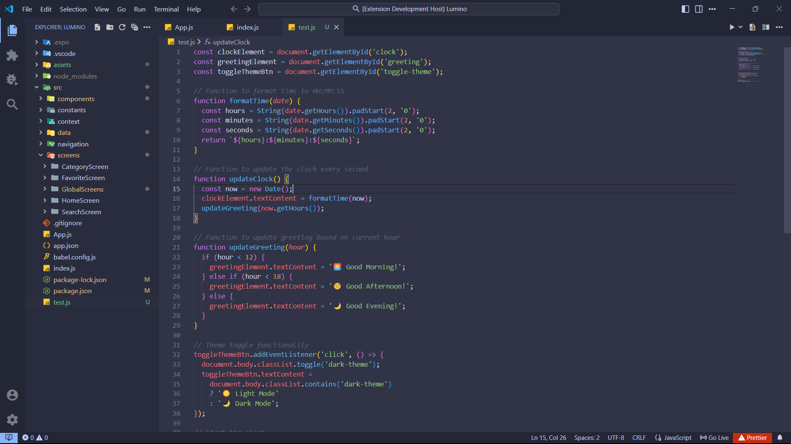
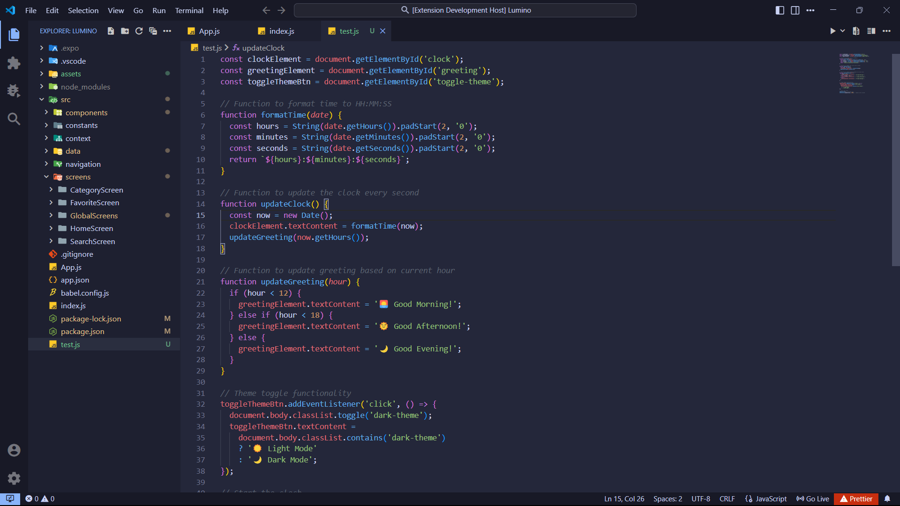
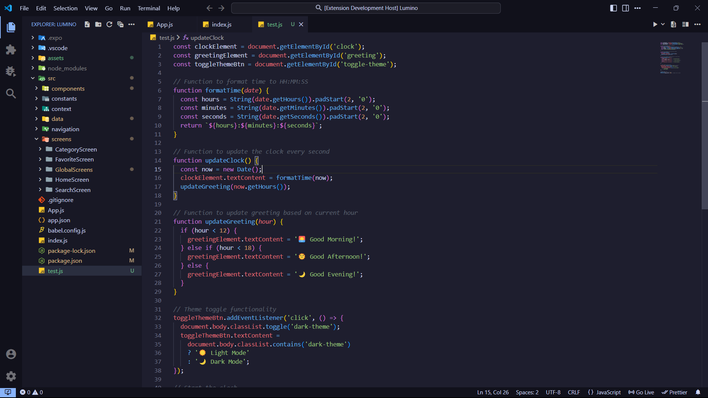

  

<h3 align="center">⭐ Lumino Themes for VS Code</h3>

## 🖼️Previews

A calm dark theme with soothing colors designed for focused, eye-friendly coding sessions.

+ ### 🌅Lumino Dusk

  The lightest of the darks — soft and soothing.

  

   
  

+ ### 🌇 Lumino Horizon

  A medium-dark theme with atmospheric tones. 

  

   
  

+ ### 🌃 Lumino Midnight

  The darkest and deepest – perfect for night owls.

  

   
  

## ⚙️ Installation

You can install this theme directly from the VS Code Marketplace:

1. Go to the Extensions view in VS Code.
2. Search for `Lumino`.
3. Click **Install**.
4. Open the Command Palette and select `Preferences: Color Theme` → Choose your favorite Lumino variant.

   + 🌅 Lumino Dusk
   + 🌇 Lumino Horizon
   + 🌃 Lumino Midnight

## Override this theme

To override this (or any other) theme in your personal config file, please follow the guide in the [color theme](https://code.visualstudio.com/api/extension-guides/color-theme) documentation. This is handy for small tweaks to the theme without having to fork and maintain your own theme.

#### 🌠 Created by Avishkar